# Phase Omega-1 — Canonical Scientific Fact Warehouse

## Warehouse contract

This warehouse records durable, externally verifiable facts. It does not decide what those facts mean for an individual animal.

Every scientific claim row has one subject, one predicate, one object or measurement, one value (when quantitative), one verbatim supporting quote, one paper/source name, and one resolvable paper/source link. A value is an observed study result or a declared measurement, never an estimate, score, rank, target, recommendation, or calculation.

The warehouse never contains an individual dog, profile, phenotype resolution, risk, confidence, ranking, recommendation, dose target, nutrition target, bundle, price-derived result, or cached output.

## 1. Scientific domain map

| Domain | Immutable facts in scope | Explicitly out of scope |
|---|---|---|
| Taxonomy and identity | Canonical identities/names for breeds, traits, conditions, ingredients, foods, activities, environments, products and units. | Aliases used only to interpret an input; display labels. |
| Breed biology | Officially described breed morphology, coat, skull conformation, historic function and life-expectancy observations. | A resolved dog's traits. |
| Trait biology | Defined physiological/conformational traits and measured biological properties. | Trait weights or importance. |
| Conditions and anatomy | Condition identity, disease class, affected system/anatomy, clinical signs and defined disease relationships. | Diagnosis, severity, individual disease status. |
| Epidemiology | Measured occurrence, prevalence, incidence or odds/risk ratio in a defined canine population. | Estimated prevalence; aggregate risk scores. |
| Biological association | Research-supported associations among breed/trait/environment/exposure/condition and protective or adverse factors. | Algorithmic modifiers or capped multipliers. |
| Activity and husbandry | Observed biological effect of an activity/husbandry exposure, including population and measured outcome. | Activity schedules or recommendations. |
| Nutrition and ingredient biology | Nutrient/ingredient identity, active compounds, biological effects, dose-response findings and safety facts. | Required dose, intervention ranking or supplement recommendation. |
| Food composition | Analysed nutrient and active-compound composition of a defined food/ingredient basis. | Meal plans and calculated intake. |
| Environment and exposure | Measured place/time environmental observations: climate, housing, walking surface/access, urbanicity and exposure patterns. | A conclusion that an environment causes a dog's condition. |
| Evidence provenance | Quote, source name, source link, publication year, study design and population recorded beside each scientific claim. | A separate evidence lookup or confidence score. |
| Commercial products | Immutable declared product identity, package, serving guide, ingredient declaration, nutrient declaration, recipe/version and availability statement. | Product suitability, ranking, price optimization, bundle or recommendation. |

## 2. Canonical dataset inventory

All identifiers are opaque, stable strings. Every entity ID is singularly canonical; names are not join keys. Each `*_facts.csv` table contains only one fact category. A fact table is append-only in principle: a new study adds a new claim; correction/retraction changes fact status rather than overwriting history.

### A. Reference identity datasets

These tables establish identity only. They must not store attributes, calculated labels, recommendations or relationship columns.

| Dataset | Kind | Purpose and permitted facts | Must never store |
|---|---|---|---|
| `reference/breeds.csv` | Reference entity | One recognized breed identity. | Trait values, health risk, prevalence. |
| `reference/traits.csv` | Reference entity | One canonical phenotype/biological trait identity. | Trait weight, inferred breed trait. |
| `reference/conditions.csv` | Reference entity | One condition identity, recognized disease class/system vocabulary reference. | Risk, protocol, disease stage for a dog. |
| `reference/anatomy.csv` | Reference entity | One anatomical structure identity. | Condition-specific relationship. |
| `reference/ingredients.csv` | Reference entity | One ingredient/nutrient/active-compound identity and material class. | Dose, effect, product membership. |
| `reference/foods.csv` | Reference entity | One identifiable whole food or food material. | Nutrient amount. |
| `reference/activities.csv` | Reference entity | One activity or husbandry exposure identity. | A schedule or prescription. |
| `reference/environments.csv` | Reference entity | One bounded geography/context identity (e.g. Shanghai urban summer), with a definition. | Causal health conclusion. |
| `reference/products.csv` | Commercial entity | One product/SKU/recipe version identity. | Recommendation, product score, inferred effect. |
| `reference/units.csv` | Reference | One canonical measurement unit and dimension. | Conversion result or display preference. |

**Columns shared by all reference entity files:**

| Column | Why it exists |
|---|---|
| `entity_id` (or domain-specific `breed_id`, etc.) | Stable, non-name primary key. |
| `canonical_name` | Human-verifiable canonical label. |
| `entity_class` | Controlled identity class, e.g. breed, condition, fatty acid, food material. |
| `external_standard` | Source nomenclature/registry (FCI, WSAVA, AAFCO, NCBI taxonomy, etc.) when applicable. |
| `external_id` | Identifier in that standard, where available. |
| `definition_quote` | Short source text defining the identity where the identity is scientific rather than commercial. |
| `definition_source` | Source/publication name for the definition. |
| `definition_url` | Verifiable source link. |
| `status` | `active`, `deprecated`, `merged`, or `retired`; preserves identity history. |

For `reference/products.csv`, replace the last three definition/provenance fields with `declaration_source` and `declaration_url`; a product identity is a commercial declaration rather than scientific evidence. `reference/units.csv` additionally has `dimension` and `symbol`, because a unit identity cannot be used safely without its physical dimension.

### B. Scientific fact datasets

Every row in each dataset below must include the common evidence block. The subject/object IDs make the row independently legible and machine-linkable; the quote/source/link make it independently auditable.

#### 1) `science/breed_trait_facts.csv`

**Purpose:** records one sourced biological or official descriptive trait fact for one breed.

**One row means:** “Breed X has trait Y with stated value Z in source S.”

| Column | Why it exists |
|---|---|
| `fact_id` | Immutable claim identifier. |
| `breed_id` | Subject. |
| `trait_id` | Predicate target/trait dimension. |
| `value_text` | Qualitative observed/described value, e.g. brachycephalic. |
| `value_number` | Numeric observation when the source provides one; otherwise blank. |
| `unit_id` | Unit for `value_number`; blank for qualitative facts. |
| `population_description` | Clarifies whether this is breed standard, registry, cohort, etc. |
| common evidence block | Makes the fact verifiable. |

Never store risk, trait contribution weight, condition, prevalence, or an inferred individual phenotype.

#### 2) `science/condition_anatomy_facts.csv`

**Purpose:** records one condition-to-anatomy/system/class relationship.

**One row means:** “Condition X affects/is classified in anatomical structure or system Y.”

| Column | Why it exists |
|---|---|
| `fact_id` | Claim ID. |
| `condition_id` | Subject. |
| `predicate` | Controlled verb: `affects_anatomy`, `belongs_to_system`, `is_disease_class`. |
| `object_id` | Anatomy, system, or condition-class reference ID. |
| `value_text` | Source-specific qualifier only, such as primary site. |
| common evidence block | Verifiability. |

Never store a diagnosis, symptom score, risk or treatment.

#### 3) `science/condition_feature_facts.csv`

**Purpose:** records one clinically defined feature of one condition: a sign, biological process or pathological mechanism.

**One row means:** “Condition X is associated with feature Y under the cited source.”

| Column | Why it exists |
|---|---|
| `fact_id`, `condition_id` | Claim and subject. |
| `predicate` | `has_clinical_feature`, `involves_process`, or `has_pathophysiology`. |
| `feature_name` | One source-defined feature; avoids a packed facet list. |
| `feature_class` | `clinical_sign`, `biological_process`, or `pathophysiology`. |
| common evidence block | Evidence beside claim. |

Never store free-text observations for an individual dog or condition severity.

#### 4) `science/epidemiology_observations.csv`

**Purpose:** preserves actual measured condition occurrence from one study population, without converting it into a general risk.

**One row means:** “In population P, condition X was observed with measure M = V.”

| Column | Why it exists |
|---|---|
| `fact_id` | Claim ID. |
| `condition_id` | Measured outcome. |
| `subject_type` / `subject_id` | Population characteristic measured: breed, trait, environment or `canine_population`. |
| `measure_type` | `prevalence`, `incidence`, `odds_ratio`, `hazard_ratio`, `relative_risk`, or `case_count`. |
| `value_number` | Reported study value exactly as normalized. |
| `unit_id` | `percent`, `proportion`, `ratio`, or `count`; no implicit unit. |
| `numerator_count`, `denominator_count` | Underlying observed counts when reported. |
| `population_description` | Breed, life stage, sex, geography, enrollment and inclusion context. |
| `observation_period` | Study period/window where reported. |
| `comparison_description` | Comparator for ratio measures. |
| common evidence block | Evidence of the specific observed statistic. |

Never store inferred prevalence, a cross-study mean, score, ranking or individual probability.

#### 5) `science/biological_association_facts.csv`

**Purpose:** records a non-epidemiological scientific association, including trait-pair or exposure-condition relationships.

**One row means:** “Subject A has relationship R with object B, with study result V.”

| Column | Why it exists |
|---|---|
| `fact_id` | Claim ID. |
| `subject_type`, `subject_id` | First subject, such as trait, ingredient, environment metric or activity. |
| `predicate` | Controlled relation: `associated_with`, `increases_occurrence_of`, `decreases_occurrence_of`, `modulates`, `supports_function_of`, `has_bioavailability_in`. |
| `object_type`, `object_id` | Second entity, usually condition, process, trait or nutrient. |
| `modifier_subject_type`, `modifier_subject_id` | Optional second trait/exposure for a genuinely paired claim; one pair per row. |
| `effect_direction` | `positive`, `negative`, `neutral`, or `not_stated`. |
| `effect_measure_type` | Reported measure name, if any. |
| `value_number`, `unit_id` | Reported result, not an engine multiplier. |
| `population_description` | Applicability context. |
| common evidence block | Evidence alongside claim. |

Never store an algorithmic factor, risk reduction score, recommendation or condition priority.

#### 6) `science/activity_effect_facts.csv`

**Purpose:** records one measured biological/clinical outcome associated with an activity or husbandry practice.

**One row means:** “Activity A in population P affected outcome B by reported measure V.”

| Column | Why it exists |
|---|---|
| `fact_id`, `activity_id` | Claim and activity subject. |
| `outcome_type`, `outcome_id` | One condition, feature or physiological outcome. |
| `exposure_description` | Study-defined intensity/duration/context, not a recommendation. |
| `measure_type`, `value_number`, `unit_id` | Observed outcome measure. |
| `population_description`, `observation_period` | Scope and temporal meaning. |
| common evidence block | Auditable study claim. |

Never store daily schedules, “frequency,” care plans, or recommendations.

#### 7) `science/ingredient_compound_facts.csv`

**Purpose:** makes ingredients reusable by recording their naturally occurring active compounds or nutrient identity.

**One row means:** “Ingredient/food X contains compound Y at measured amount V on basis B.”

| Column | Why it exists |
|---|---|
| `fact_id` | Claim ID. |
| `subject_type`, `subject_id` | Ingredient or food material. |
| `compound_id` | Canonical nutrient/active compound object. |
| `measure_type` | `concentration`, `content`, `presence`, or `bioavailable_fraction`. |
| `value_number`, `unit_id` | Measured amount in canonical unit. |
| `basis_quantity`, `basis_unit_id` | Required denominator, e.g. per 100 g edible portion. |
| `preparation_state` | Raw, cooked, dried, extract, standardized extract, etc. |
| `analytical_method` | Method when reported. |
| common evidence block | Verifiability of composition claim. |

Never store a food recommendation, recipe amount, or calculated nutrient intake.

#### 8) `science/ingredient_effect_facts.csv`

**Purpose:** records a research-supported biological effect for an ingredient, nutrient or active compound.

**One row means:** “Ingredient X modulates/supports biological outcome Y in population P at reported exposure.”

| Column | Why it exists |
|---|---|
| `fact_id`, `ingredient_id` | Claim and subject. |
| `predicate` | Controlled biological relation: `modulates`, `supports`, `reduces_marker_of`, `increases_marker_of`, `affects_bioavailability_of`. |
| `outcome_type`, `outcome_id` | One condition, process, marker or physiological function. |
| `exposure_amount`, `exposure_unit_id` | Study exposure only; never a recommended dose. |
| `exposure_basis` | Per dog, per kg body mass, diet percentage, etc. |
| `measure_type`, `value_number`, `unit_id` | Reported effect. |
| `population_description` | Species/life stage/disease context. |
| `safety_note` | Source-supported adverse/safety qualifier only. |
| common evidence block | Evidence of this precise effect. |

Never store therapeutic target dose, condition priority, product match or recommendation.

#### 9) `science/environment_observations.csv`

**Purpose:** records measured environmental/exposure facts for a named environment and time period.

**One row means:** “Environment E had measured metric M = V during period T.”

| Column | Why it exists |
|---|---|
| `fact_id`, `environment_id` | Claim and contextual subject. |
| `metric_name` | One measured metric: temperature, relative humidity, heat index, dwelling type proportion, green-space access, pavement exposure, outdoor activity, etc. |
| `value_number`, `unit_id` | Measured value in canonical unit. |
| `statistic` | `mean`, `median`, `range_low`, `range_high`, `proportion`, or `count`. |
| `season_or_period` | Required temporal boundary. |
| `population_description` | Human/canine/household sampling frame as relevant. |
| `method_note` | Measurement/survey method if needed to interpret the fact. |
| common evidence block | Source beside observation. |

Never store a conclusion that the environment causes a specific condition or a care recommendation.

#### 10) `science/food_composition_facts.csv`

**Purpose:** a food-specific specialization of composition facts where the food is a defined edible material or preparation.

**One row means:** “Food F contains nutrient/compound C at amount V per declared basis.”

Columns are identical to `ingredient_compound_facts.csv`, with `food_id` replacing `subject_type`/`subject_id`. Do not duplicate a fact in both files: use ingredient composition for material/extract facts and food composition for named edible-food facts.

### C. Commercial declaration datasets

Commercial declarations are immutable facts supplied by a manufacturer, label or controlled product specification. They are not scientific claims and therefore use declaration provenance, not paper evidence. A new recipe, reformulation or package is a new `product_id`/version rather than a silent overwrite.

| Dataset | One row means | Required columns | Must never store |
|---|---|---|---|
| `commercial/product_packages.csv` | Product P is sold in package Pkg with declared net content. | `package_id`, `product_id`, `package_name`, `net_quantity`, `unit_id`, `package_form`, `declaration_source`, `declaration_url`, `effective_date` | Price, discount, bundle, recommendation. |
| `commercial/product_serving_declarations.csv` | Product P declares serving guidance for one stated weight/life-stage range. | `declaration_id`, `product_id`, `animal_life_stage`, `weight_min`, `weight_max`, `weight_unit_id`, `declared_serving_amount`, `serving_unit_id`, `servings_per_day`, `declaration_source`, `declaration_url`, `effective_date` | Calculated feeding amount, target dose, personalized plan. |
| `commercial/product_ingredient_declarations.csv` | Product P declares ingredient I at one label position or declared amount. | `declaration_id`, `product_id`, `ingredient_id`, `declaration_type`, `label_order`, `declared_amount`, `unit_id`, `basis_quantity`, `basis_unit_id`, `declaration_source`, `declaration_url`, `effective_date` | Inferred concentration, efficacy, suitability. |
| `commercial/product_nutrient_declarations.csv` | Product P declares nutrient/compound C at a stated amount/basis. | `declaration_id`, `product_id`, `compound_id`, `declared_amount`, `unit_id`, `basis_quantity`, `basis_unit_id`, `guarantee_type`, `declaration_source`, `declaration_url`, `effective_date` | Coverage percent, nutrient target, clinical function score. |
| `commercial/product_recipe_declarations.csv` | Product P declares a recipe/formulation/version attribute. | `declaration_id`, `product_id`, `recipe_version`, `attribute_name`, `attribute_value`, `declaration_source`, `declaration_url`, `effective_date` | Product recommendation or computed nutrition. |
| `commercial/product_availability_facts.csv` | Product P is declared active/retired/available in a specified market on a date. | `fact_id`, `product_id`, `market`, `availability_status`, `effective_date`, `declaration_source`, `declaration_url` | Inventory prediction, ranking or sales data. |

## 3. Common evidence strategy

Every row in `science/*_facts.csv` ends with this exact evidence block:

| Column | Requirement |
|---|---|
| `supporting_quote` | A concise verbatim quote that supports this one claim. No empty values. |
| `paper_title` | Source/paper title. No empty values. |
| `paper_url` | Direct DOI, PubMed, journal, or permanent source URL. No empty values. |
| `publication_year` | Publication year when known. |
| `study_design` | Controlled description: meta-analysis, systematic_review, randomized_trial, cohort, cross_sectional, case_control, case_series, experimental, guideline, official_standard, composition_database, or other. |
| `evidence_subject` | The study's actual species/population; prevents accidental transfer across populations. |
| `source_locator` | DOI, PMID, table/figure/page, or source section that locates the quote. |
| `claim_status` | `active`, `superseded`, `retracted`, or `under_review`. |

The paper is deliberately repeated beside each claim. A paper registry is not required for verification and must not be necessary to understand a row. Repetition of bibliographic metadata is acceptable; repetition of the same **claim** is not. The unique scientific-claim key is the normalized tuple of subject, predicate, object, reported measure/value, population, source locator, and paper URL.

## 4. Ingredient and product philosophy

### Ingredient knowledge

An ingredient is a reusable biological material, nutrient, active compound or food material. It exists independently of brands and may be connected to food composition, a product declaration, a recipe or a research study. Its facts belong only in:

- `reference/ingredients.csv` for identity;
- `science/ingredient_compound_facts.csv` for what it contains;
- `science/ingredient_effect_facts.csv` for supported biological effects and study exposures;
- `science/food_composition_facts.csv` where the subject is a defined edible food.

No ingredient table may contain “supports joint health” flags, product IDs, recommended dose, priority, lane, or confidence. Those are either incomplete interpretations of a claim or runtime decisions.

### Products

Products are commercial entities. The warehouse may state exactly what the producer declares: identity/version, package quantity, serving guide, ingredient declaration, nutrient guarantee, recipe declaration and availability. These facts are allowed because they can be checked against a product label/specification.

Products must not contain therapeutic claims invented by the warehouse, calculated active yield, clinical-function score, price, review count, featured status, tags, package tier, bundle, cost efficiency, target coverage, or a recommendation. A declared manufacturer health claim, if retained at all, is a product declaration with its label source; it is not scientific evidence of efficacy.

## 5. Environment philosophy

Environment records observations, not causal shortcuts. A place/time context can have a temperature, humidity, pavement exposure, housing proportion, green-space access, average outdoor time, urban density or climate classification. Each is a separate observation with season/period and evidence.

For example, the valid row is “Shanghai urban summer: mean relative humidity = X percent, period Y, source Z.” The invalid row is “Shanghai causes heat stress.” Any relationship between an environmental measure and a condition belongs in `biological_association_facts.csv` only when a study supports that relationship.

## 6. Measurement standard

Numbers are never stored without explicit units and bases. Values are stored as decimal numbers without thousands separators; units are stored by canonical `unit_id`.

| Measurement | Canonical stored unit | Required basis/notes |
|---|---|---|
| Mass of animal, food, ingredient or package | `g` | Use `kg` only for a stated animal body-mass range in declarations; normalize all analytic quantities to g. |
| Concentration/content | `mg_per_100_g` | Pair with preparation state; use `ug_per_100_g` only when required to avoid false precision. |
| Nutrient/active amount | `mg` | A separate `basis_quantity`/`basis_unit_id` specifies per 100 g, per serving, per kg body mass, etc. |
| Protein/fat/fiber/moisture/ash | `g_per_100_g` | Declare as-fed or dry-matter in `preparation_state`/basis. |
| Energy | `kcal_per_100_g` | Use a separate basis for a declared serving. |
| Relative humidity / prevalence proportion | `percent` | Percent is 0–100, never a mixture of 0–1 and 0–100. |
| Epidemiological ratios | `ratio` | `measure_type` distinguishes odds, hazard and relative risk. |
| Temperature | `degC` | Never mix Fahrenheit. |
| Time | `min`, `day`, `year` | Activity study exposure remains a fact, not a schedule. |
| Distance | `m` | Convert km to m. |
| Microbial count | `CFU` | Use `CFU` or `CFU_per_g`, never label wording such as “billion CFU.” |
| Capsules/tablets/pieces | `count` | A count is not a mass and must not be treated as one. |

Derived unit conversions, percentages, daily intakes and serving calculations are not warehouse rows.

## 7. Normalization report

The existing facts should be normalized as follows before import:

1. Create one identity record per breed, trait, condition, ingredient, food, activity, environment, product and unit. Resolve spelling/case variants (`Omega-3`, `EPA+DHA`, BOAS, arthritis/osteoarthritis) through documented canonical IDs; do not preserve aliases as scientific claims.
2. Convert breed-condition and trait-condition rows into `epidemiology_observations` only where the value is a directly reported study observation and the study population/counts can be represented. Do not import any value that is an inferred or synthesized prevalence.
3. Convert trait-pair “interaction” and “benefit” rows into one association fact per reported claim. Do not import a factor merely because an engine used it; preserve a study effect measure only if the source reports it.
4. Merge `condition_ingredients`, `condition_protocols`, and `nutrient_priorities` by decomposing each into ingredient-effect/dose-response claims. Identical claims become one row. Conflicting dose/exposure statements remain separate source-specific facts; neither becomes a recommendation.
5. Split multiplexed trait-science and activity-science rows: one trait attribute/effect or one activity outcome per row. A source list or list-valued field never occupies one fact cell.
6. Merge `foods` and `food_sources` into identity plus composition facts; retain each food ID once.
7. Preserve product data only as manufacturer declarations, split by package, serving guide, ingredient declaration and nutrient declaration. Remove marketing fields and all price/review/bundle material.
8. Remove `sci`/`prev` lanes, formula labels, source CSV fields, ranking fields, confidence fields, package tiers, defaults, aliases, score weights, clamps, display catalogues and report snapshots. They are not immutable science facts.
9. Do not import a placeholder evidence row. A claim without a real quote, paper/source and permanent link is rejected until evidence is available.
10. Maintain claim uniqueness by the evidence-aware claim key, not merely by condition/ingredient names. Two different studies can validly produce two facts; the same source statement cannot.

## 8. Final warehouse diagram

```mermaid
erDiagram
  BREEDS ||--o{ BREED_TRAIT_FACTS : "described by"
  TRAITS ||--o{ BREED_TRAIT_FACTS : "is trait"
  CONDITIONS ||--o{ CONDITION_ANATOMY_FACTS : "has anatomy/class"
  ANATOMY ||--o{ CONDITION_ANATOMY_FACTS : "is object"
  CONDITIONS ||--o{ CONDITION_FEATURE_FACTS : "has feature"
  CONDITIONS ||--o{ EPIDEMIOLOGY_OBSERVATIONS : "is outcome"
  BREEDS ||--o{ EPIDEMIOLOGY_OBSERVATIONS : "population characteristic"
  TRAITS ||--o{ EPIDEMIOLOGY_OBSERVATIONS : "population characteristic"
  ENVIRONMENTS ||--o{ ENVIRONMENT_OBSERVATIONS : "is measured"
  ACTIVITIES ||--o{ ACTIVITY_EFFECT_FACTS : "has observed effect"
  INGREDIENTS ||--o{ INGREDIENT_COMPOUND_FACTS : "contains"
  INGREDIENTS ||--o{ INGREDIENT_EFFECT_FACTS : "has studied effect"
  FOODS ||--o{ FOOD_COMPOSITION_FACTS : "contains"
  INGREDIENTS ||--o{ FOOD_COMPOSITION_FACTS : "is compound"
  PRODUCTS ||--o{ PRODUCT_PACKAGES : "sold as"
  PRODUCTS ||--o{ PRODUCT_SERVING_DECLARATIONS : "declares serving"
  PRODUCTS ||--o{ PRODUCT_INGREDIENT_DECLARATIONS : "declares ingredient"
  PRODUCTS ||--o{ PRODUCT_NUTRIENT_DECLARATIONS : "declares nutrient"
  INGREDIENTS ||--o{ PRODUCT_INGREDIENT_DECLARATIONS : "declared in"
  INGREDIENTS ||--o{ PRODUCT_NUTRIENT_DECLARATIONS : "declared nutrient"
```

## Acceptance test for any proposed row

A row belongs only if all answers are “yes”:

1. Is it a durable observation, definition, study result or manufacturer declaration rather than a decision?
2. Does it describe one subject–relationship–object/measurement claim only?
3. Can someone verify it immediately from the quote, source and permanent link (or a product declaration source)?
4. Is every numeric value unitized and, where applicable, based on an explicit denominator/population/period?
5. Would the row remain true and useful without knowing any individual dog or product recommendation?

If the answer to any question is “no,” it is not part of this canonical fact warehouse.
