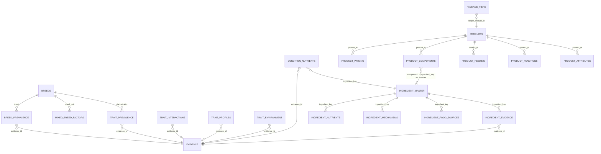

# Data Relationships

**Status:** Current ER map + target ER map (planning)  
**Source of truth for PKs/FKs today:** `data/manifest.yaml`

---

## Current entity relationship diagram

```mermaid
erDiagram
    BREEDS ||--o{ BREED_ALIASES : "canonical_breed"
    BREEDS ||--o{ BREED_CONDITIONS : breed
    BREEDS ||--o{ MIXED_BREED_MATRIX : "breed_a/breed_b"
    BREEDS ||--o{ TRAIT_ATTRS : "trait fields"

    TRAIT_ATTRS ||--o{ SIZE_CONDITIONS : size
    TRAIT_ATTRS ||--o{ BODYTYPE_CONDITIONS : body_type
    TRAIT_ATTRS ||--o{ COATTYPE_CONDITIONS : coat_type
    TRAIT_ATTRS ||--o{ ENERGY_CONDITIONS : energy
    TRAIT_ATTRS ||--o{ SKULLTYPE_CONDITIONS : skull_type
    TRAIT_ATTRS ||--o{ CLIMATE_CONDITIONS : climate
    TRAIT_ATTRS ||--o{ FUNCTIONGROUP_CONDITIONS : function_group
    TRAIT_ATTRS ||--o{ WEAKNESSGROUP_CONDITIONS : weakness_group
    TRAIT_ATTRS ||--o{ LIFESPAN_CONDITIONS : lifespan

    TRAIT_INTERACTIONS ||--o{ CONDITIONS : condition
    TRAIT_BENEFITS ||--o{ CONDITIONS : condition
    MIXED_BREED_INTERACTIONS ||--o{ CONDITIONS : "unused duplicate"

    CONDITIONS ||--o{ CONDITION_INGREDIENTS_SCI : condition
    CONDITIONS ||--o{ CONDITION_INGREDIENTS_PREV : condition
    CONDITIONS ||--o{ NUTRIENT_PRIORITIES : condition
    CONDITIONS ||--o{ CONDITION_PROTOCOLS : "unused"
    CONDITIONS ||--o{ CONDITION_ACTIVITIES : condition

    INGREDIENTS ||--o{ INGREDIENT_EVIDENCE_SCI : ingredient_name
    INGREDIENTS ||--o{ INGREDIENT_EVIDENCE_PREV : ingredient_name
    INGREDIENTS ||--o{ INGREDIENT_MECHANISMS : ingredient_name
    INGREDIENTS ||--o{ NATURAL_FOOD_SOURCES : ingredient_name
    INGREDIENTS ||--o{ INGREDIENT_ALIASES : canonical_key
    INGREDIENTS ||--o{ INGREDIENT_NUTRIENT_ESTIMATES : canonical_ingredient
    PRODUCTS ||--o{ INGREDIENT_MECHANISMS : "source_product_id WRONG HOME"

    PRODUCTS ||--o{ PRODUCT_PRICING : product_id
    PRODUCTS ||--o{ PRODUCT_COMPONENTS : product_id
    PRODUCTS ||--o{ PRODUCT_FEEDING_RULES : product_id
    PRODUCTS ||--o{ PRODUCT_FUNCTIONS : product_id
    PRODUCTS ||--o{ EXT_SUPPLEMENTS : product_id
    PRODUCTS ||--o{ EXT_TREATS_BAKERY : product_id
    PRODUCTS ||--o{ PACKAGE_TIERS : staple_product_id
    PRODUCTS ||--o{ PRODUCT_DEFAULTS : "unused"

    CLINICAL_EVIDENCE_BASE ||--o{ TRAIT_ATTRIBUTE_EXPLANATIONS : evidence_id
    CLINICAL_EVIDENCE_BASE ||--o{ TRAIT_CONTRIBUTION_WEIGHTS : evidence_id
    CLINICAL_EVIDENCE_BASE ||--o{ CLINICAL_RISK_TIMELINE : evidence_id
```

Notes:

- `TRAIT_ATTRS` is not a file — it is columns on `BREEDS`.  
- Nine trait condition files share one logical relationship (trait × condition).  
- Sci/prev ingredient trees are parallel edges to the same conceptual entities.  
- `INGREDIENT_MECHANISMS.source_product_id` crosses the science↔commerce boundary incorrectly.

---

## Cardinality (current)

| From | To | Cardinality | Join keys |
|------|----|-------------|-----------|
| BREEDS | BREED_CONDITIONS | 1:N | `breed` |
| BREEDS | trait conditions | 1:N via attribute | e.g. `size` |
| trait_a×trait_b | TRAIT_INTERACTIONS | N:N via condition | `trait_a`,`trait_b`,`condition` |
| condition | CONDITION_INGREDIENTS_* | 1:N | `condition`,`ingredient_name` |
| ingredient | INGREDIENT_EVIDENCE_* | 1:N | `ingredient_name` |
| product | PRODUCT_COMPONENTS | 1:N | `product_id` |
| product | PRODUCT_FEEDING_RULES | 1:N | `product_id` + weight band |
| evidence_id | narrative tables | 1:N | `evidence_id` |
| package tier | staple product | N:1 | `staple_product_id` |

---

## Target entity relationship diagram (3NF)

**No product FK inside ingredient science.** Product amounts live only under `PRODUCT_COMPONENTS`.

---

## Orphans / weak links (current)

| Table | Issue |
|-------|--------|
| `mixed_breed_interactions` | No runtime consumer |
| `activity_evidence` | No runtime consumer |
| `condition_protocols` | No typed consumer |
| `product_defaults` | Indexed, never read |
| `STAPLE_FOOD` / `TREATS` | Unmanifested |
| `EXT_SUPPLEMENTS` | Empty |

---

## Related

[DATA_NORMALIZATION.md](DATA_NORMALIZATION.md) · [DATA_DUPLICATION_REPORT.md](DATA_DUPLICATION_REPORT.md) · [DATA_CONSUMERS.md](DATA_CONSUMERS.md)
