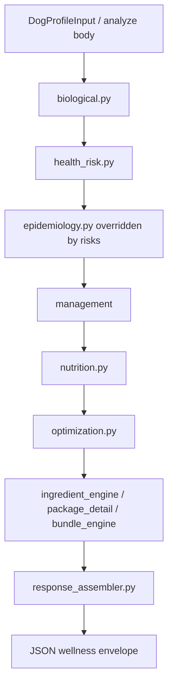

# PPIE Migration Report

**Status:** Python is the sole production PPIE runtime.  
**Archive tag:** `legacy-node-final` (`8575606`)  
**Migration commits:** `282ddb7` (Python routes + docs), `8575606` (archive Node tree), retirement commit follows.

---

## Algorithm summary

Deterministic pipeline in `app/agent/engine.py`:

```
biology → health_risk → epidemiology (legacy) → management → nutrition → optimization → assemble_frontend_response
```

Canonical algorithm reference: [PPIE_ALGORITHM.md](PPIE_ALGORITHM.md)  
CSV dependency map: [PPIE_CSV_MAP.md](PPIE_CSV_MAP.md)  
Response contract: [PPIE_RESPONSE_SCHEMA.md](PPIE_RESPONSE_SCHEMA.md)

---

## Pipeline diagram



---

## API endpoint map

| Method | Path | Runtime | Auth |
|--------|------|---------|------|
| GET | `/health` | Python | none |
| POST | `/api/v1/analyze` | Python | `x-api-key` |
| POST | `/api/v2/wellness/evaluate` | Python | none |
| POST | `/api/recommendations` | Python | `x-api-key` |
| GET | `/api/v1/evidence/{condition}` | Python | `x-api-key` |
| GET | `/api/v1/products/{condition}` | Python | `x-api-key` |
| GET | `/api/breeds` | Python | none |
| POST | `/api/v1/groomer/update` | Python | `x-api-key` |
| GET | `/api/v1/groomer/session/{id}` | Python | `x-api-key` |
| POST | `/api/groomer/submit` | Python | none (legacy) |
| GET | `/` `/app.js` `/styles.css` | Python static | none |

Node Express routes are **removed**. Restore via `git checkout legacy-node-final`.

---

## Production migration summary

1. Behavioral parity proven (Dolly + 10-profile suite, 3× zero diffs).
2. FastAPI gained Node-compatible `/api/v1/*` contracts (`app/api/main.py`).
3. Payload adapter accepts Node `breeds[]`/`weight`/`birthday` bodies.
4. Evidence/products helpers ported (`app/api/evidence.py`).
5. Regression suite switched to frozen goldens (`tools/parity_suite.py`).
6. Tag `legacy-node-final` created with full Node tree in history.
7. Node engine/server deleted from working tree.

---

## JavaScript retirement summary

| Path | Action | Rationale |
|------|--------|-----------|
| `src/engine/` | **DELETED** | Replaced by `app/agent/` |
| `server.js` | **DELETED** | Replaced by uvicorn |
| `server/` | **DELETED** | Legacy `computeRecommendations` path |
| `src/api/` | **DELETED** | Routes moved to FastAPI |
| `src/db/` | **DELETED** | Duplicate CSV loaders |
| `src/socket/` | **DELETED** | No production groomer.html; HTTP sessions only |
| `src/security/` | **DELETED** | API keys handled in FastAPI |
| `package-lock.json` / npm deps | **REMOVED** | No Express runtime |
| `app.js` `index.html` `styles.css` | **RETAINED** | Static demo UI |
| `package.json` | **RETAINED** | Scripts delegate to Python |

Import audit: [PPIE_IMPORT_AUDIT.md](PPIE_IMPORT_AUDIT.md)

---

## Files retained (production)

- `app/agent/**` — algorithm
- `app/api/**` — HTTP API
- `app/ui/**` — Streamlit demo
- `data/**` — CSV knowledge base
- `tools/parity_suite.py` — golden regression
- `tests/parity/**/golden_response.json` — fixtures
- `docs/**` — algorithm / schema references

---

## Regression suite results

| Check | Result |
|-------|--------|
| Mode | golden_vs_python |
| Profiles | 10/10 |
| Consecutive runs | 3/3 all zero diffs |
| Dolly golden | PASS |
| Endpoint smoke (`/api/v1/analyze`, evidence, products, breeds) | HTTP 200 |

Command:

```bash
py -3 tools/parity_suite.py --repeat 3
```

---

## Commit hashes

| Hash / tag | Meaning |
|------------|---------|
| `5dfc5cc` | Multi-profile parity fixes |
| `282ddb7` | Python production routes + algorithm docs |
| `8575606` / **`legacy-node-final`** | Full Node archive in git |
| (retirement commit) | Delete Node runtime paths |

---

## Known limitations

1. **Birthday-derived age drift:** goldens embed `age_years` computed at freeze time. Re-freeze when calendar age rounds change (`tools/parity_suite.py --freeze`).
2. **Socket.IO realtime:** not ported. Groomer HTTP session endpoints work; websocket fan-out is absent.
3. **HMAC license middleware:** Node `verifyHmac` / license gate not ported; API key gate remains.
4. **Great Dane:** not in `BREEDS.csv`; suite uses Great Pyrenees as giant stand-in.
5. **Historical `js_response.json`:** retained under `tests/parity/*/js_response.json` for forensic comparison only.

---

## Future development guidelines

1. Change algorithms **only** in `app/agent/` with intentional documentation updates.
2. After intentional output changes, run `py -3 tools/parity_suite.py --freeze` and commit new goldens.
3. Never reintroduce `src/engine` into production paths.
4. Treat [PPIE_RESPONSE_SCHEMA.md](PPIE_RESPONSE_SCHEMA.md) as the external API contract.
5. Restore Node only via `git checkout legacy-node-final` for archaeology — not for production.

---

## End state checklist

- [x] Python API starts successfully
- [x] Production endpoints respond on Python
- [x] Golden regression suite passes (3×)
- [x] No production `require('../engine')` / `server/logic` / `server.js`
- [x] Git tag `legacy-node-final` preserves Node archive
- [x] README / package.json describe Python-only runtime
