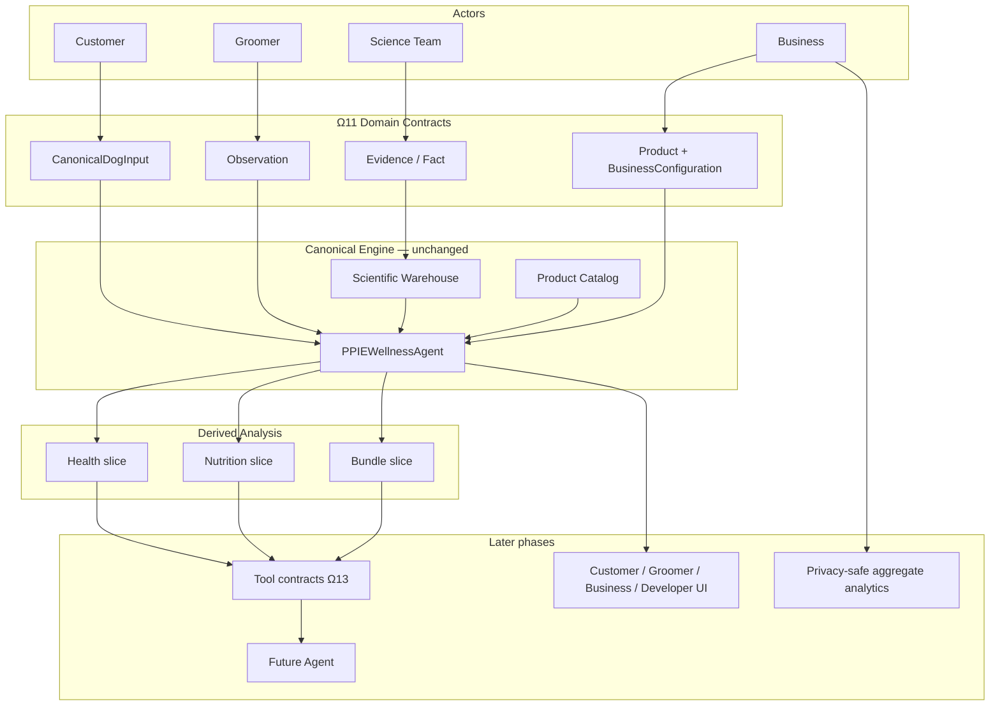

# Ω11 Agent Data Contract — Design Report

Status: DESIGN (implementation follows this document).
Date: 2026-09-06.
Engine version inspected: `ALGORITHM_VERSION = "2.1.0"` (`app/agent/version.py`).
Engine name: `PPIE`.

This phase defines typed domain contracts for future agent tools. It does not implement Gemini, MCP, a tool server, chat UI, or warehouse writes.

## Authority chain

```
USER DATA
    ↓
OBSERVATION
    ↓
CANONICAL NORMALIZATION
    ↓
APPROVED SCIENTIFIC / PRODUCT DATA
    ↓
DETERMINISTIC WAGGY ENGINE
    ↓
DERIVED ANALYSIS
    ↓
TOOL RESULT
    ↓
AGENT EXPLANATION
```

**THE LLM IS NOT AN AUTHORITY IN THIS CHAIN.**

## What this phase does not do

Ω11 does NOT:

- implement Gemini
- implement a tool server
- implement MCP
- implement chat UI
- implement agent mutations
- implement business analytics
- modify scientific reasoning
- modify optimizer mathematics
- modify warehouse evidence
- change existing customer/business/developer presentation logic

Those belong to later phases (Ω12+).

---

# 1. Existing Models

| Path | Name | Purpose | Fields (core) | Consumers | Agent-contract suitability | Reuse |
|---|---|---|---|---|---|---|
| `app/agent/state.py` | `DogProfileInput` | Engine/API dog input | name, primary/secondary breed, split, age_years, weight_kg, environment, activity, sex/gender, birthday, height, bcs, observed_conditions[], monthly_budget | `PPIEWellnessAgent`, `/api/v2/wellness/evaluate`, payload adapter | Suitable as **engine** input. Not suitable as the agent contract: required floats, silent adapter defaults, observations as bare strings, no PROVIDED/UNKNOWN states | **Reuse unchanged** as engine model. Agent input wraps/adapts to it |
| `app/api/payload_adapter.py` | `profile_from_analyze_body` | Loose JSON → `DogProfileInput` | Dual dialects; **defaults age 5.0, weight 20.0, env Temperate Indoor, activity Moderate**; birthday age uses `datetime.now()` | `/api/v1/analyze`, workbench, clinical-report | **Not** the agent contract. Hidden defaults violate Ω11 | Leave unchanged. Document as application-adapter gap |
| `repository/models/runtime.py` | `DogProfile` | Immutable pipeline profile | dog_id, name, breeds, age/weight optional, observations tuple, groomer_observations | Architecture tests, repository pipeline | dog_id convention useful; still untyped observations | Reuse `dog_id` convention only. Do not duplicate as second input model |
| `app/agent/state.py` | `ProductFulfillment`, `ActiveIntervention`, `WellnessReportPayload`, `AgentPipelineState` | Legacy pipeline blobs | Mixed; `Dict[str, Any]` stages | Internal / unused as public tool I/O | Too generic / UI-era | Do not promote |
| `app/science/models.py` | `EvidenceObject`, `GraphNode`, `GraphEdge` | Science graph records | paper_id/title/url/year, citations as dicts | Science graph API | Field names useful; dataclass + dict citations | **Adapter** from these names; new typed evidence contract |
| `app/science/versioning.py` | `VersionedScience` | Algorithm + warehouse + evidence + papers versions | algorithm, warehouse, evidence, papers, formula_graph, knowledge_graph | `GET /api/v1/science/versions` | Reuse algorithm + warehouse. `evidence`/`papers` use `date.today()` (not deterministic). Do **not** copy that as a second engine version | Reuse `algorithm` ← `ALGORITHM_VERSION`. Warehouse from repo/manifest |
| `app/data/schemas.py` | `Manifest`, `FileSpec` | CSV platform schema | version, files, PKs | Data loader | Warehouse version source | Reuse version string, do not wrap as agent I/O |
| `warehouse/repository/entities.py` | `Breed`, `Condition`, `Product`, `Paper`, `BreedConditionRel` | Storage entities | fact-like relation fields + paper/quote | Warehouse entity layer | Good fact/product/paper names | Conceptual reuse; agent contract is Pydantic, not these dataclasses |
| `app/data/scientific_care.py` | `resolve_care_model` → dict | Health findings | condition_records, prevalence, preventative_targets, evidence_status, `NOT_AVAILABLE_FROM_SCIENTIFIC_WAREHOUSE` | package_search, assembler `careModel` | **Capability source**. Output is untyped dict | Slice adapter only. Do not reimplement |
| `app/data/scientific_requirements.py` | `build_requirement_profile` → dict | Nutrient minima | nutrients{min,max,unit,basis,source}, senior `NOT_AVAILABLE`, `NOT_MODELED` | package_search | Nutrition slice source | Adapter only |
| `app/agent/package_search.py` | `run_package_search` → dict | Exhaustive optimizer | package_options, provenance.filter_funnel, nutrition_ledger | package_optimizer | Bundle slice source | Adapter only |
| `app/presentation/adapter.py` | `build_workbench_presentations` | Role projections | customer/groomer/business/developer copy | workbench HTTP | Presentation, not canonical | Frozen. Report tool later projects from analysis |
| `legacy/authoring/models.py` | authoring drafts | Staging writes | schema `authoring_*.v1` | Authoring API | WRITE / science team | **Outside** agent read/calculate surface |

---

# 2. Existing Analysis Structure

`PPIEWellnessAgent.generate_reproducible_report` → `AssessmentResult.to_analyze_dict()` (`app/agent/response_assembler.py`).

| Domain | Analyze key | Notes |
|---|---|---|
| Dog/profile | `profile`, alias `pet` | Normalized engine profile |
| Biology | `biology` | Breed/trait stage |
| Health | `careModel`, `healthInsights` | Warehouse preventative model |
| Nutrition | `requirementProfile`, `nutritionalTargets` | Density minima + targets |
| Products | `productRecommendations`, alias `products` | Weak matcher; not a public tool |
| Bundles | `packageOptions`, `wellnessPackages` | Essential / Balanced / Optimal lists |
| Optimizer | `optimizerProvenance` | Funnel, ranking rules, `llm_used: false` |
| Evidence | `scientificEvidence`, alias `evidence` | Collected citations |
| Versions | `engine`, `version` | `PPIE` + `ALGORITHM_VERSION` |
| Presentation / debug | `debug`, `groomer`, legacy aliases, role copy | **Exclude** from canonical agent analysis |

HTTP that already calls this one function: `POST /api/v1/analyze`, `/api/v2/wellness/evaluate`, `/api/v1/presentation/workbench`, `/api/v1/presentation/three-surfaces`, `/api/v1/clinical-report`.

---

# 3. Existing Provenance Structure

Do not invent fields. Current sources:

**Warehouse fact row** (`warehouse/biology/observed_breed_conditions.csv`):
`fact_id`, `breed_id`, `breed_name`, `condition_id`, `condition_name`, `measure_type`, `value_number`, `unit`, `scientific_quote`, `paper_name`, `paper_link`, `publication_year`, `study_type`, `species`, `status`.

**Paper row** (`warehouse/reference/papers.csv`):
`paper_id`, `paper_name`, `authors`, `journal`, `publication_year`, `doi`, `pmid`, `paper_link`, `study_type`, `species`, `scientific_quote`, `status`.

**Engine care record**: `paper_name`, `scientific_quote`, `paper_link`, `publication_year`, `evidence[]`, `status` (`WAREHOUSE_EVIDENCE` or `NOT_AVAILABLE_FROM_SCIENTIFIC_WAREHOUSE`).

**Optimizer provenance**: `algorithm: PACKAGE_OPTIMIZER_V2_1`, `search_method`, subset counts, `filter_funnel`, `constraint_failures`, `ranking_rules`, `llm_used: false`.

**HTTP headers**: `X-PPIE-Algorithm-Version`, `X-PPIE-Data-Version`, `X-PPIE-Csv-Hash`.

**Clinical assessment**: `content_hash` ← `csv_hash`.

**Science `EvidenceObject`**: `id`, `paper_id`, `paper_title`, `url`, `year`, `source_table`, `source_row`, `citations`.

Gaps: no single reusable `ProvenanceRecord` type; no analysis_id; paper vs fact evidence can sit on the condition record (one paper line) even though relationships are the real evidence home.

---

# 4. Existing Versioning

| Layer | Actual value / mechanism | Location |
|---|---|---|
| Engine | `ALGORITHM_VERSION = "2.1.0"` | `app/agent/version.py` |
| Engine name | `ENGINE_NAME = "PPIE"` | same |
| Analyze `version` | same `2.1.0` | response_assembler |
| Warehouse / data | `DataRepository.version` from platform/manifest | `app/data/repository.py` |
| Manifest file | `warehouse/manifest.yaml` → `version: "5.0.0-science"` (science_only schema; historical `warehouse/science`) | used by `current_science_versions()` |
| CSV hash | `DataRepository.csv_hash` (SHA-256 prefix of loaded CSVs) | `app/data/cache.py` |
| Science versions API | algorithm + warehouse + evidence month + papers date | `app/science/versioning.py` — evidence/papers dates are **not** a second engine version; do not copy into agent as authority |
| Authoring schemas | `authoring_evidence.v1`, `authoring_materialize.v1` | API only |
| **Missing** | `tool_version`, agent `schema_version` | Ω11 defines these **additively** |

Ω11 will **not** replace `ALGORITHM_VERSION`. New: `AGENT_CONTRACT_SCHEMA_VERSION = "1.0.0"` and reserved `tool_version` on registry entries.

---

# 5. Existing Error/Status Model

| Token | Where | Meaning |
|---|---|---|
| `NOT_AVAILABLE_FROM_SCIENTIFIC_WAREHOUSE` | scientific_care | No usable warehouse evidence |
| `NOT_AVAILABLE` | prevalence_status, senior minima, debug | No approved/usable value |
| `WAREHOUSE_UNAVAILABLE` | human copy | Same scientific gap, prose |
| `WAREHOUSE_EVIDENCE` | careModel.evidence_status | Rows found |
| `AVAILABLE` | prevalence_status | Numeric observed prevalence present |
| `NEEDS_VALIDATION` | papers, product_master.status, mapping | Present, not validated science |
| `MISSING_PROVENANCE` | breed_traits and recovery mapping | Identity/phenotype without citation |
| `migrated` | observed_breed_conditions.status | Recovered intern row — **not** APPROVED |
| `NOT_MODELED` | nutrition categories | Named but no numeric min/max |
| `NOT_APPLICABLE` | senior_specific_minima when not senior | N/A |
| HTTP 400 `ValueError` | analyze | Bad payload (e.g. missing breed in adapter) |
| HTTP 401 / 403 / 500 | API | Auth / debug / pipeline failure |
| Optimizer `VALID`, `FAIL_MINIMUM`, `FAIL_MAXIMUM`, `INSUFFICIENT_DATA`, `OVER_BUDGET` | package_search | Constraint outcomes |

**APPROVED** is not a current warehouse status. Ω11 includes it as a *future* scientific-use state. **Do not map `migrated` → APPROVED.**

Application HTTP has no first-class `MISSING_REQUIRED_INPUT` / `NO_VALID_BUNDLES` objects. Those are Ω11 boundary codes. Reuse warehouse tokens where they already mean the same thing (`NOT_AVAILABLE`, `NEEDS_VALIDATION`, `MISSING_PROVENANCE`).

---

# 6. Contract Gaps

1. No named tools / registry / invocation host (Ω13).
2. No typed slices for health / nutrition / bundles.
3. Analyze is a mixed application dict (aliases, debug, UI).
4. Agent input cannot represent UNKNOWN / NOT_PROVIDED (engine uses floats + silent defaults).
5. Observations are `list[str]`, not typed OBSERVATION records.
6. No reusable provenance type.
7. No analysis_id (correlation_id exists only on workbench).
8. No tool_version / agent schema_version.
9. No typed tool errors.
10. Demo mode and groomer session merge are process/host state, not explicit inputs.
11. Product matching is too weak for a public `match_products` tool.
12. Authoring WRITE routes share the same HTTP app as calculate routes.

---

# 7. Proposed Ω11 Contract Architecture

```
Existing application payload  →  (unchanged APIs)
Canonical adapter (Ω11, unused by HTTP)  →  typed domain models
Future tools (Ω13)  →  slices of one generate_reproducible_report
Presentation adapter (existing)  →  four UIs
```

Package: `app/contracts/agent/` (new). No existing contracts package.

| Model | File | Role |
|---|---|---|
| `FieldValue[T]` + `InputState` | `input.py` | PROVIDED / UNKNOWN / NOT_PROVIDED / NOT_APPLICABLE / INVALID |
| `CanonicalDogInput` | `input.py` | Agent dog input; required: breed, age, weight |
| `Observation` | `observations.py` | OBSERVATION ≠ fact ≠ diagnosis |
| `ScientificEvidence` | `evidence.py` | Paper/study reference |
| `ScientificFact` | `evidence.py` | Approved relationship + status |
| `ScientificInference` / `ConditionFinding` | `inference.py` + `health.py` | Derived engine results |
| Product* + `BusinessConfiguration` | `products.py` | Commercial vs science |
| `HealthAnalysisResult` | `health.py` | Future `analyze_health` output |
| `NutritionAnalysisResult` | `nutrition.py` | Future `calculate_nutrition` output |
| `BundleSearchResult` | `bundles.py` | Future `optimize_bundles` output |
| `CanonicalAnalysis` | `analysis.py` | One-run envelope + optional analysis_id |
| `ProvenanceRecord` | `provenance.py` | Shared chain |
| `VersionStamp` | `versions.py` | engine + warehouse + schema + tool |
| `ToolError` | `errors.py` | Typed boundary errors |
| `AgentContext` | `context.py` | Bounded actor context (no warehouse dump) |
| `ToolRegistryEntry` | `registry.py` | Names only; no execute |
| Adapters | `adapters.py` | Map existing models ↔ contracts; **no reasoning** |

Future tools (documented, not implemented):

| Tool | Operation | Input | Output |
|---|---|---|---|
| `analyze_health` | READ+CALCULATE | `CanonicalDogInput` | `HealthAnalysisResult` |
| `calculate_nutrition` | READ+CALCULATE | `CanonicalDogInput` | `NutritionAnalysisResult` |
| `optimize_bundles` | READ+CALCULATE | dog + `BusinessConfiguration` | `BundleSearchResult` |
| `generate_report` | PROJECTION | analysis_id / `CanonicalAnalysis` | presentation (existing builders later) |

One engine run may populate all slices. Tools must not become five reasoners.

---

# 8. Compatibility Strategy

- Do not change `DogProfileInput`, payload adapter, analyze routes, or presentation.
- New package is import-safe: contracts import `ALGORITHM_VERSION` and `DogProfileInput` only.
- Adapters **refuse** silent age=5 / weight=20. Existing HTTP still uses the old adapter.
- Engine identity test forbids contracts from importing optimizer / scientific_care / engine class.
- Existing tests must keep passing without golden-file edits.

---

# 9. Files Proposed For Change

**Add**

- `app/contracts/` package (typed models + adapters + registry)
- `tests/contracts/` contract tests
- `tests/architecture/test_omega11_boundaries.py`
- `docs/omega11-agent-data-contract-design.md` (this file)
- `docs/omega11-agent-contract-inventory.md`
- `docs/omega11-agent-data-contract-report.md`

**Minimal doc pointers**

- `docs/WAGGY_SYSTEM.md` — add contract-layer pointer; correct the leftover “Ω11 = validate warehouse flags” line
- `docs/README.md` — link the three Ω11 docs

**Do not change in Ω11:** `app/api/main.py`, `app/agent/*` (except importing version/state from contracts), formulas, optimizer, warehouse CSVs, presentation, legacy UI.

---

# 10. Files Explicitly Frozen

- `app/agent/engine.py`, `package_optimizer.py`, `package_search.py`, `response_assembler.py`, `formula_graph.py`, formula stages
- `app/data/scientific_care.py`, `scientific_requirements.py`, `warehouse_biology.py`
- `warehouse/**` including `recovery_original/`
- `app/api/main.py`, `app/api/payload_adapter.py`
- `app/presentation/adapter.py`
- `legacy/workbench.*` and other UI
- Authoring WRITE routes (remain off the agent surface)

No blocker: contract-only implementation can proceed without those files.

---

# Domain matrix

| Domain | Owner | Input/Output | Scientific authority | Mutable by agent? | Provenance required? |
|---|---|---|---|---|---|
| Dog profile (`CanonicalDogInput`) | Customer | Input | No | Future authorized fields only | Optional (source = user) |
| Groomer observation | Groomer | Input | No | Future authorized observations | Observation provenance |
| Scientific evidence | Science | Evidence | Yes | NO | YES |
| Scientific fact | Science / warehouse | Fact | YES | NO | YES |
| Scientific inference | Engine | Derived | Derived | NO | YES |
| Product fact | Catalog / business | Fact | No (not medical) | Controlled | YES where applicable |
| Commercial configuration | Business | Config | No | Future authorized fields | Config provenance |
| Health analysis | Engine | Derived | Derived | NO | YES |
| Nutrition analysis | Engine | Derived | Derived | NO | YES |
| Bundle result | Optimizer | Derived | Derived | NO | YES |
| Analytics | Analytics layer (future) | Aggregate | No | Controlled | YES |
| Report | Presentation | Projection | No | NO | Inherits analysis |

---

# Future AI boundary (documentation only)

Gemini may eventually: understand language, identify intent, select authorized tools, construct structured tool requests, explain results, summarize provenance, ask for missing inputs.

Gemini may NOT: access the warehouse or raw tables, create facts, modify evidence, invent prevalence/nutrients/products/prices, choose products outside the optimizer, override hard nutrient constraints or ranking, modify mappings, bypass permissions, or treat authoring routes as read tools.

---

# Data-flow



Customer scientific profiles do not flow into business analytics.

---

# Sample contracts (synthetic / labeled EXAMPLE)

Values below are **examples for serialization**, not new warehouse facts.

### 1. Valid dog input

```json
{
  "dog_id": null,
  "name": {"state": "PROVIDED", "value": "Dolly"},
  "primary_breed": {"state": "PROVIDED", "value": "Golden Retriever"},
  "secondary_breed": {"state": "PROVIDED", "value": "Labrador Retriever"},
  "breed_split_pct": {"state": "PROVIDED", "value": 50.0},
  "age_years": {"state": "PROVIDED", "value": 5.2},
  "birthday": {"state": "NOT_PROVIDED", "value": null},
  "weight_kg": {"state": "PROVIDED", "value": 24.0},
  "sex": {"state": "PROVIDED", "value": "female"},
  "activity_level": {"state": "PROVIDED", "value": "Moderate"},
  "environment": {"state": "PROVIDED", "value": "Temperate Indoor"},
  "monthly_budget": {"state": "NOT_PROVIDED", "value": null},
  "observations": []
}
```

### 2. Missing required field

```json
{
  "primary_breed": {"state": "NOT_PROVIDED", "value": null},
  "age_years": {"state": "UNKNOWN", "value": null},
  "weight_kg": {"state": "NOT_PROVIDED", "value": null}
}
```

Tool validation → `MISSING_REQUIRED_INPUT` (not age=5, not weight=20).

### 3. Groomer observation

```json
{
  "domain": "OBSERVATION",
  "observer_role": "groomer",
  "observation_type": "coat_density",
  "value": "dense coat",
  "dog_id": "DOG::dolly"
}
```

### 4. Approved scientific evidence (synthetic EXAMPLE — not a warehouse fact)

```json
{
  "domain": "SCIENTIFIC_EVIDENCE",
  "paper_id": "EXAMPLE_PAPER",
  "paper_name": "Example paper",
  "paper_link": "https://example.invalid/paper",
  "publication_year": "2021",
  "study_type": "observational",
  "species": "canine",
  "scientific_quote": "Example quote",
  "status": "NEEDS_VALIDATION",
  "warehouse_version": "example",
  "source_table": "observed_breed_conditions",
  "relationship_ref": "EXAMPLE_FACT"
}
```

The warehouse does not currently label rows `APPROVED`. This example stays `NEEDS_VALIDATION`.

### 5. Scientific fact (synthetic EXAMPLE)

```json
{
  "domain": "SCIENTIFIC_FACT",
  "fact_id": "EXAMPLE_FACT",
  "subject": "Example Breed",
  "relationship": "prevalence",
  "object": "Example Condition",
  "value": 0.127,
  "unit": "ratio",
  "status": "NEEDS_VALIDATION",
  "warehouse_version": "example"
}
```

### 6. NOT_AVAILABLE scientific result

```json
{
  "status": "NOT_AVAILABLE",
  "percent": null,
  "ratio": null,
  "unit": null
}
```

Never `0`. Never an industry average.

### 7. Product fact

```json
{
  "domain": "PRODUCT_FACT",
  "identity": {"product_id": "EXAMPLE_SKU", "product_name": "Example Food", "category": null, "brand": null},
  "commercial": {"price": null, "currency": null, "catalog_status": null, "availability_status": null, "advertising_status": null, "fulfillment_status": null},
  "nutrition": [],
  "evidence": [],
  "eligibility": null
}
```

Missing price stays null. The adapter does not invent a price.

### 8. Health result (empty warehouse evidence)

```json
{
  "domain": "DERIVED_ANALYSIS",
  "capability": "analyze_health",
  "findings": [],
  "trait_associations": [],
  "preventative_targets": [],
  "evidence_status": "NOT_AVAILABLE",
  "prevalence_available": false,
  "diagnosis_claim": false
}
```

### 9. Nutrition result (density minima; no invented daily amount)

```json
{
  "domain": "DERIVED_ANALYSIS",
  "capability": "calculate_nutrition",
  "basis": "dry_matter_diet_density",
  "nutrients": [{
    "nutrient_id": "protein_pct_dm",
    "display": "Protein",
    "daily_requirement": null,
    "daily_requirement_status": "NOT_AVAILABLE",
    "minimum": 18.0,
    "maximum": null,
    "unit": "% DM",
    "basis": "percent_dry_matter",
    "breed_recommended": false
  }],
  "complete_diet_claim": false
}
```

### 10. Bundle result

```json
{
  "domain": "DERIVED_ANALYSIS",
  "capability": "optimize_bundles",
  "essential": [],
  "balanced": [],
  "optimal": [],
  "optimizer": {"algorithm": "PACKAGE_OPTIMIZER_V2_1", "llm_used": false},
  "status": "NO_VALID_BUNDLES"
}
```

### 11. Typed error

```json
{
  "code": "MISSING_REQUIRED_INPUT",
  "message": "Missing required input: age_years, weight_kg",
  "fields": ["age_years", "weight_kg"]
}
```

### 12. Version metadata

```json
{
  "engine_name": "PPIE",
  "engine_version": "2.1.0",
  "warehouse_version": "5.0.0-science",
  "csv_hash": "abc123",
  "schema_version": "1.0.0",
  "tool_version": "1.0.0",
  "analysis_version": "2.1.0"
}
```

### 13. Provenance chain record

```json
{
  "source_type": "warehouse_row",
  "fact_id": "EXAMPLE_FACT",
  "paper_id": "EXAMPLE_PAPER",
  "source_name": "Example paper",
  "source_link": "https://example.invalid/paper",
  "publication_year": "2021",
  "quote": "Example quote",
  "status": "NEEDS_VALIDATION",
  "engine_version": "2.1.0",
  "capability_id": "analyze_health"
}
```

---

# Negative examples (NOT_ALLOWED)

1. Gemini states a prevalence number with no approved fact → `NOT_AVAILABLE`; filling from “common knowledge” is forbidden.
2. Gemini recommends Product Z if Z is not in `optimize_bundles` output → forbidden.
3. Business “Brand X is scientifically better” is commercial opinion, not a scientific fact.
4. Groomer “dense coat” is an observation, not a disease.
5. `NEEDS_VALIDATION` or `MISSING_PROVENANCE` or `migrated` must not be serialized as `APPROVED`.
6. `monthly_budget` NOT_PROVIDED must not become `0`.
7. Authoring materialize is not an agent read tool.

---

# Internal design review

- One engine; contracts transport, they do not compute.
- Existing `DogProfileInput` kept; agent input is a parallel typed layer.
- Version reuse: `ALGORITHM_VERSION` + repository warehouse/csv_hash + new schema/tool versions only.
- Status reuse: warehouse tokens kept; APPROVED not forged from migrated.
- No API, UI, MCP, Gemini, warehouse writes.
- Smallest file set: new `app/contracts` + tests + docs.

Design is internally consistent. Implementation proceeds.
