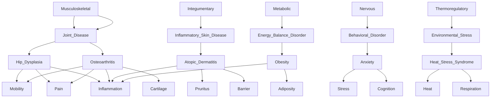

# Condition Ontology

```mermaid
graph TD
  Musculoskeletal --> Joint_Disease
  Joint_Disease --> Hip_Dysplasia
  Hip_Dysplasia --> Mobility
  Hip_Dysplasia --> Pain
  Hip_Dysplasia --> Inflammation
  Musculoskeletal --> Joint_Disease
  Joint_Disease --> Osteoarthritis
  Osteoarthritis --> Mobility
  Osteoarthritis --> Pain
  Osteoarthritis --> Inflammation
  Osteoarthritis --> Cartilage
  Integumentary --> Inflammatory_Skin_Disease
  Inflammatory_Skin_Disease --> Atopic_Dermatitis
  Atopic_Dermatitis --> Pruritus
  Atopic_Dermatitis --> Barrier
  Atopic_Dermatitis --> Inflammation
  Metabolic --> Energy_Balance_Disorder
  Energy_Balance_Disorder --> Obesity
  Obesity --> Adiposity
  Obesity --> Inflammation
  Nervous --> Behavioral_Disorder
  Behavioral_Disorder --> Anxiety
  Anxiety --> Stress
  Anxiety --> Cognition
  Thermoregulatory --> Environmental_Stress
  Environmental_Stress --> Heat_Stress_Syndrome
  Heat_Stress_Syndrome --> Heat
  Heat_Stress_Syndrome --> Respiration
```
